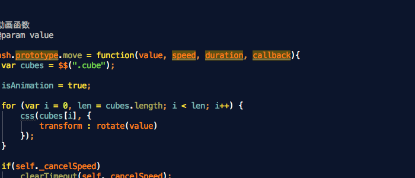

Splash.js
===========

这是一个图片切换插件， 可以实现一些碎玻璃的效果

## Usage

实现图片切换只需以下的简单代码

**html**

        

        	
			
        

       
**js**

        

## 注意事项

图片的宽高必须与容器的宽高相同，否则会出现错位的情况。

## 切换列表

会动态创建在container容器内

    <ul>
        <li class="select">1</li>
        <li class="selected">2</li>
        <li class="select">3</li>
    </ul>
    
根据图片的数量来生成li，并添加select类， 当前被选取的图片的类为selected. 
ul 和 li 的样式需要自己去设定.

### 可选参数：
1. cube_map // 容器内小方块的数量，总共为 cube_map * cube_map个
2. isContinue // 是否轮播
3. duration // 动画结束后的时间间隔
4. speed // 动画的时间
5. index // 动画开始时的索引
6. isContinue // 切换是不是需要连播
7. transitionEnd: function(){console.log(this)} // 动画结束后触发的回调函数， this指向为当前的li对象

